# Hi, I'm Raheela Chand 👋
**PhD Researcher @ University of Turku | AI for Games • Game Analytics • Data-Centric AI | Unity Developer**

## Research Interests

* AI for Games
* Computational Game Analytics
* Data-Centric AI
* Player Behaviour Analytics
* Explainable AI
* Interaction-Aware Learning
* Intelligent Game Development
* Large Language Models for Games
* Imitation Learning

## 💻 Published Research

#### 📚 TTAG+R - A Dataset of Google Play Store's Top Trending Android Games and User Reviews

A large-scale dataset of Google Play's top trending Android games and user reviews supporting research in game analytics, machine learning, and software engineering.

* 📄 **Publication:** https://ieeexplore.ieee.org/document/10077024
* </> **Repository:** https://github.com/AndroidGamesResearch/Dataset-of-Trending-Android-Games-with-User-Reviews

#### 📚 An ML-Based Quality Features Extraction (QFE) Framework for Android Apps

Developed an automated framework that analyzes Android app user reviews and maps user-reported concerns to software quality attributes, turning unstructured feedback into structured, quality-focused information for software evaluation.

* 📄 **Publication:** https://link.springer.com/chapter/10.1007/978-3-031-45651-0_27
* </> **Code & Research Artifacts:** https://github.com/AndroidGamesResearch/Dataset-of-Software-Quality-Attributes

#### 📚 Exploring Software Quality Through Data-Driven Approaches and Knowledge Graphs

Transformed theoretical software quality models into reusable, machine-readable resources—including structured datasets, CSV files, Python dictionaries, and knowledge graphs—bridging the gap between conceptual quality models and computational analysis.

* 📄 **Publication:** https://link.springer.com/chapter/10.1007/978-3-031-60328-0_37
* </> **Code & Research Artifacts:** https://github.com/AndroidGamesResearch/MappingAndroidFeaturesToQualityAttributes

## Ongoing Research

* **GameMetaDroid** *(under development)* — A large-scale dataset for AI-driven mobile game analytics.
* **Interaction Analysis for Game Analytics** *(in progress)* — Research on interaction-aware learning and interpretable machine learning for understanding game success.

## 🎮 Game Development

Before transitioning into research, I worked professionally and independently with Unity on mobile, cross-platform, VR/XR, and interactive game projects.

## 🥌 USA Curling Game

   Unity
  &nbsp;·&nbsp;
   C#
  &nbsp;·&nbsp;
   iOS
  &nbsp;·&nbsp;
   Android

Developed the USA Curling mobile game in Unity for iOS and Android as part of my professional work, implementing core gameplay, player-controlled shots, sweeping interactions, scoring, two-player mechanics, and online multiplayer. The game also featured in-game advertising and sponsor banner integrations, incorporating branded promotional content throughout the gameplay experience.

### - Key Features & Technical Highlights

* **Online Multiplayer** — two-player networked gameplay
* **Physics-Based Gameplay** — curling stone movement and interactions
* **Sweeping Mechanics** — player-controlled sweeping system
* **Game Systems** — scoring, turn-management system, aiming, and shot controls
* **Advertising Integration** — in-game ads and sponsor banners
* **Cross-Platform** — iOS and Android
* **Project:** - [USA Curling](https://www.teamusa.com/)

  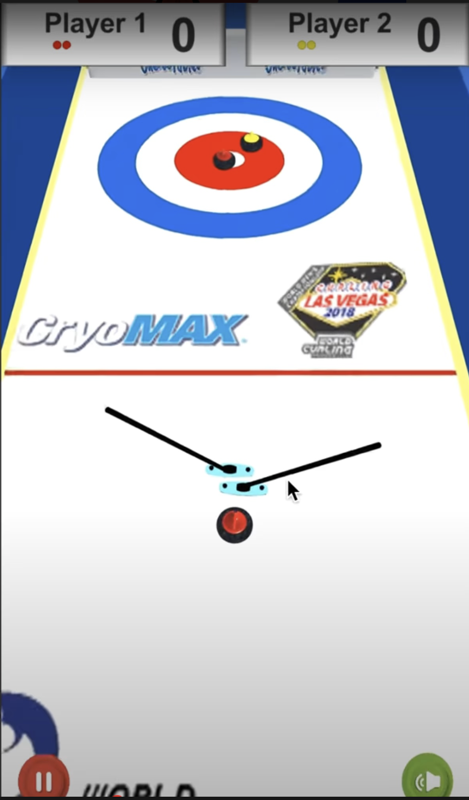
  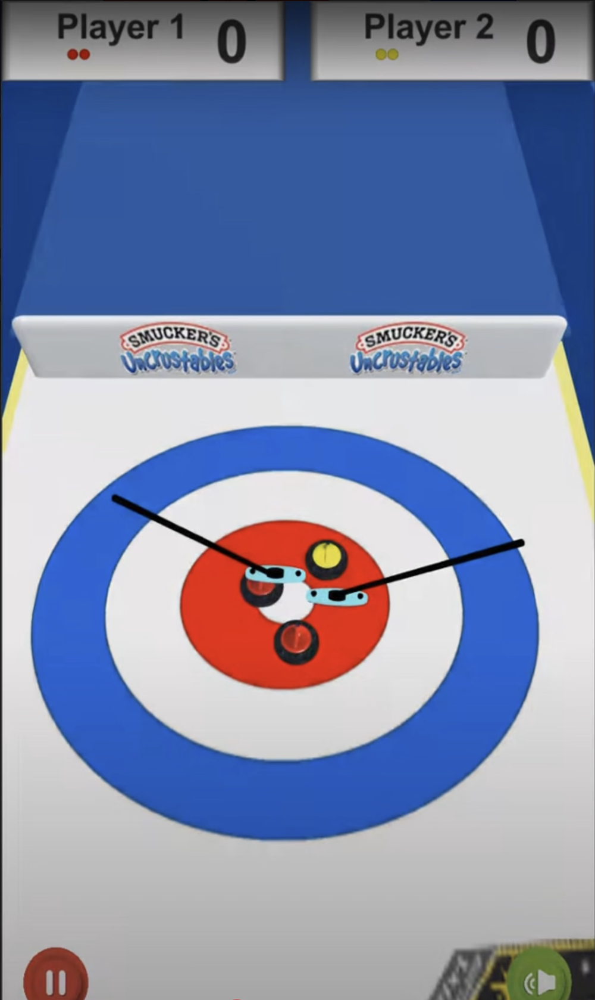
  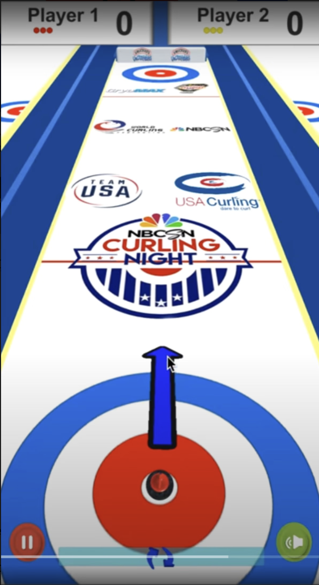
   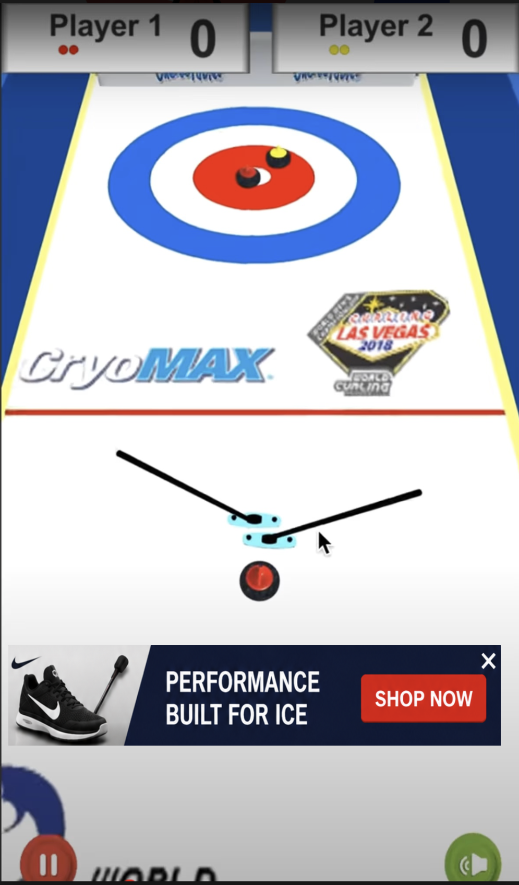
   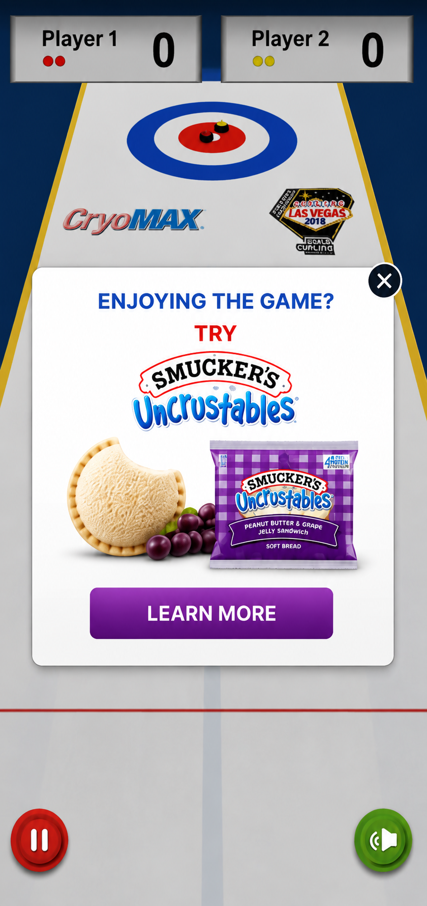
  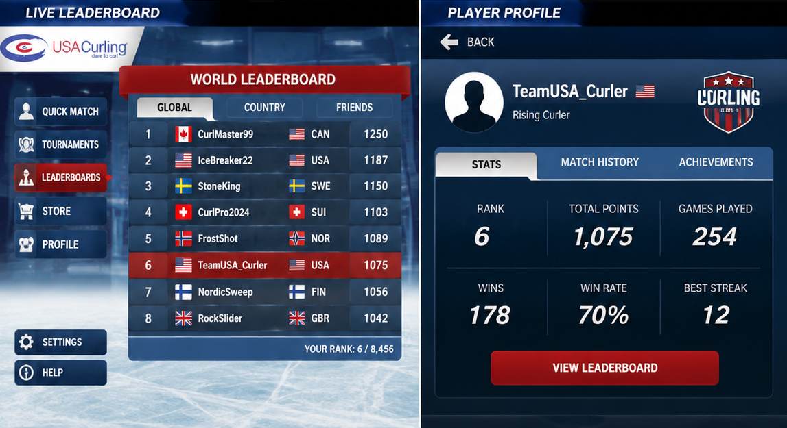

## 🌀 Fidget Spinner

   Unity
  &nbsp;·&nbsp;
   C#
  &nbsp;·&nbsp;
   tvOS / Apple TV & iOS
  &nbsp;·&nbsp;
   Android

Developed a cross-platform Fidget Spinner game in Unity for Apple TV (tvOS), iOS, and Android, featuring two-player competitive gameplay, physics-based spinning mechanics, multiple selectable spinner designs, platform-specific controls, customization, and in-app purchases (IAP).

### Key Features & Technical Highlights

- **Two-Player Gameplay** — competitive spinner gameplay
- **Physics-Based Gameplay** — interactive fidget spinner mechanics
- **Cross-Platform Development** — Apple TV (tvOS), iOS & Android
- **Apple TV Remote Controls** — tvOS gameplay using the Apple TV remote
- **Spinner Collection** — multiple spinner designs to choose from
- **Customization System** — selectable and unlockable spinner variations
- **In-App Purchases (IAP)** — additional content and customization
- **Project** - [View project](Assets/fidgetspinner)

  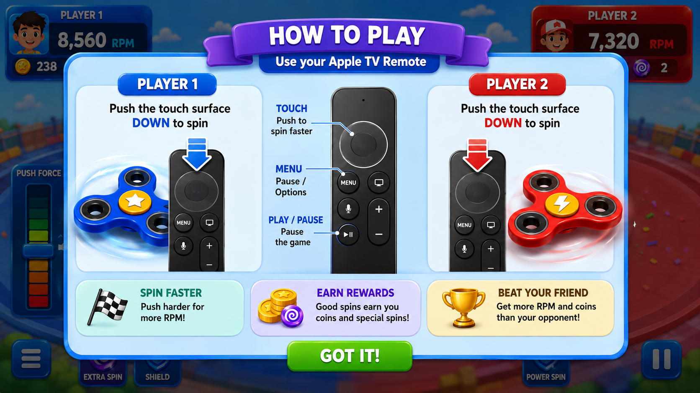
   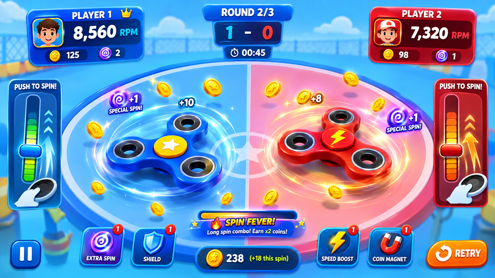
  
  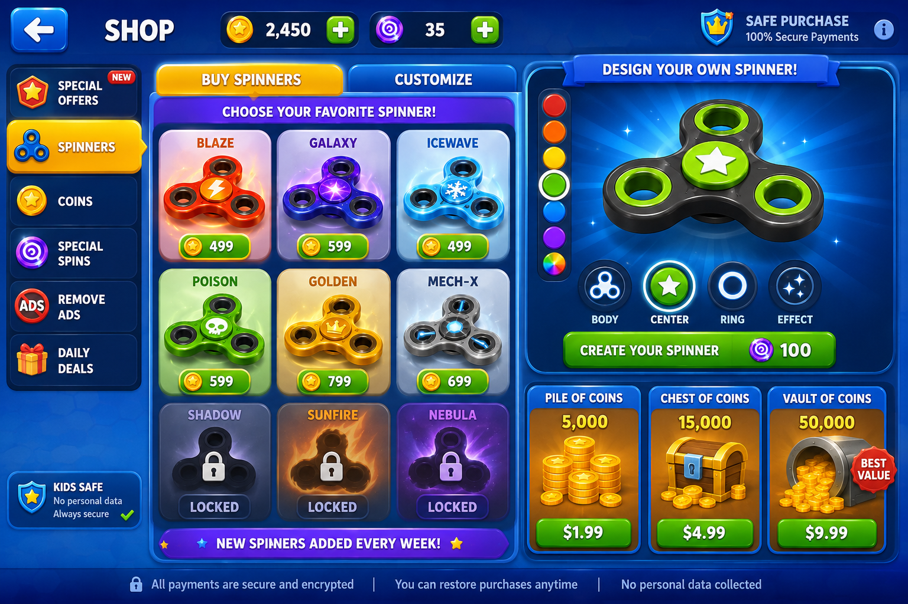
   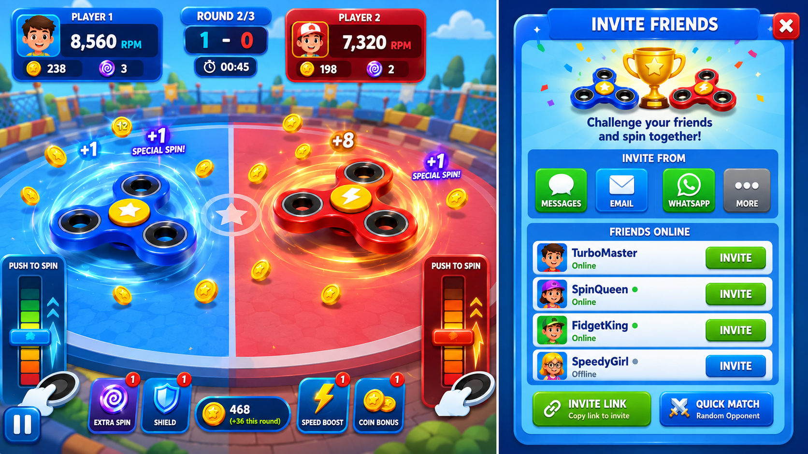
  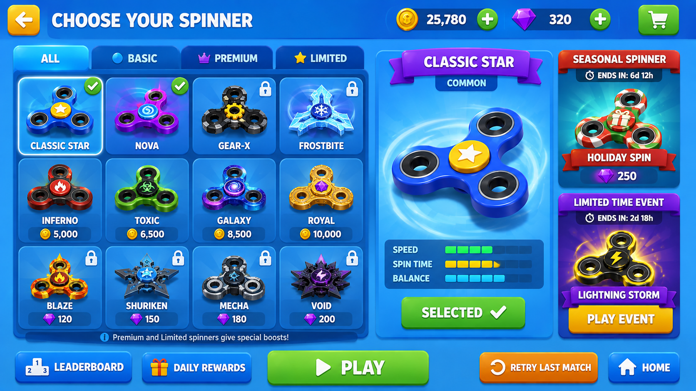
   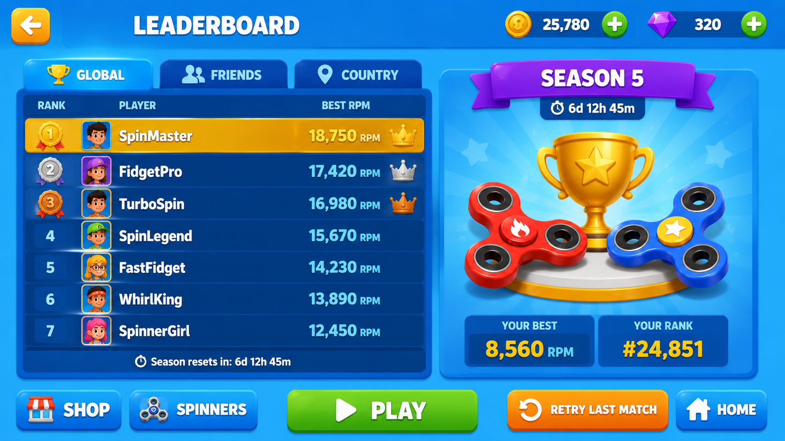

## ❌⭕ VR Tic-Tac-Toe

  🥽 Oculus Quest 2
  &nbsp;·&nbsp;
  🎮 Touch Controllers
  &nbsp;·&nbsp;
   Unity
  &nbsp;·&nbsp;
   C#

Developed a VR Tic-Tac-Toe game in Unity, featuring immersive controller-based interaction and a computer-controlled AI opponent. Players interact directly with the 3D game board in VR to place moves and compete against the AI.

### Key Features & Technical Highlights

- **AI Opponent** — computer-controlled Tic-Tac-Toe gameplay
- **Oculus Touch Controllers** — motion-controller based board interaction
- **VR Interaction** — point-and-select interaction in a 3D environment
- **Game AI & Logic** — AI decisions, turns, win conditions, and draw detection
- **Motion-Sickness-Aware Design** — stationary gameplay with minimal artificial movement
- **Spatial UI** — VR-friendly interface positioned within the 3D environment
- **Oculus Quest 2** — standalone VR deployment
- **Project** - [View project](Assets/fidgetspinner/Assets/VR_TicTacToe)

  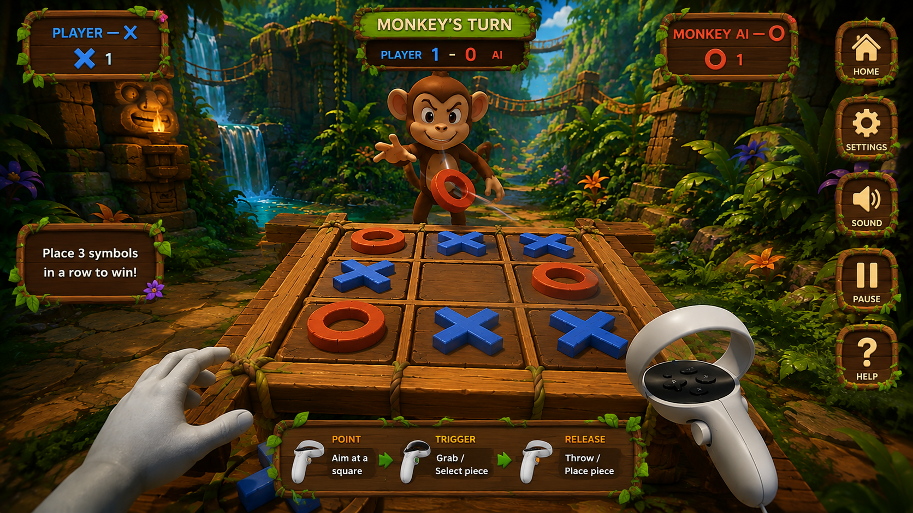
   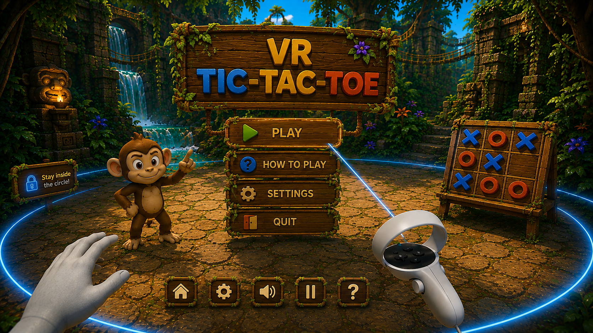
  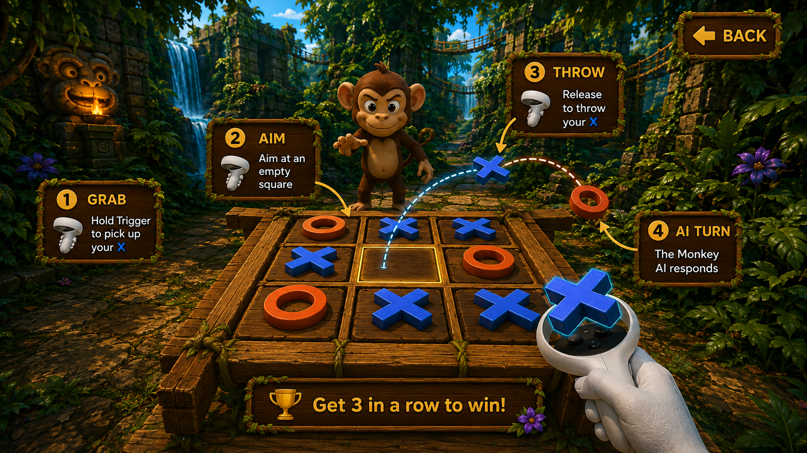
  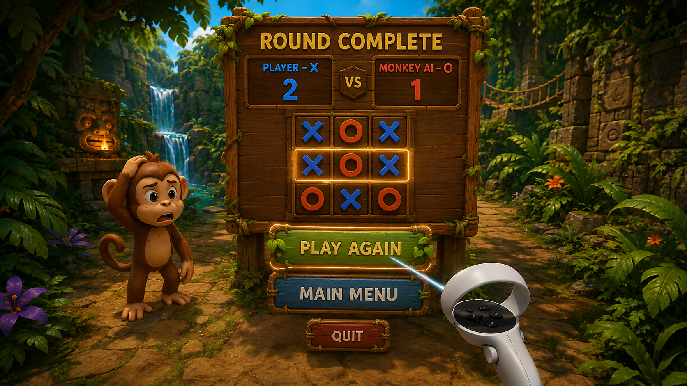

### Selected Unity Projects

- **Limbo-Inspired 2D Platformer** — 2D gameplay and physics
- **Hit & Run Shooter**
- **2D Car Racing**
- **3D Cubes**
- **Bubble Buster**
